# Code along learning projects from:
- TraversyMedia
- FlorinPop
- EasyTutorials
- TylerPotts
- Bedimcode

|  #  | Project  | Demo          |Thumbnail|
| :-: | -------- | ------------- |---------|
|0| [Under cunstraction](https://github.com/xml12333/HTML_CSS_JS/tree/main/0.Under%20cunstraction)| [Demo](https://nikt.com.ua/projects/htmlCssJs/0.Under%20cunstraction/)| |
|1| [Expanding Cards](https://github.com/xml12333/HTML_CSS_JS/tree/main/1.Expanding%20Cards)| [Demo](https://nikt.com.ua/projects/htmlCssJs/1.Expanding%20Cards/)| |
|2| [Progress Steps](https://github.com/xml12333/HTML_CSS_JS/tree/main/2.Progress%20Steps)| [Demo](https://nikt.com.ua/projects/htmlCssJs/2.Progress%20Steps/)| |
|3| [Rotating Navigation](https://github.com/xml12333/HTML_CSS_JS/tree/main/3.Rotating%20Navigation)| [Demo](https://nikt.com.ua/projects/htmlCssJs/3.Rotating%20Navigation/)| |
|4| [Hidden Search Widget](https://github.com/xml12333/HTML_CSS_JS/tree/main/4.Hidden%20Search%20Widget)| [Demo](https://nikt.com.ua/projects/htmlCssJs/4.Hidden%20Search%20Widget/)| |
|5| [Blurry Loading](https://github.com/xml12333/HTML_CSS_JS/tree/main/5.Blurry%20Loading)| [Demo](https://nikt.com.ua/projects/htmlCssJs/5.Blurry%20Loading/)| |
|6| [Scroll Animation](https://github.com/xml12333/HTML_CSS_JS/tree/main/6.Scroll%20Animation)| [Demo](https://nikt.com.ua/projects/htmlCssJs/6.Scroll%20Animation/)| |
|7| [ Split Landing Page](https://github.com/xml12333/HTML_CSS_JS/tree/main/7.%20Split%20Landing%20Page)| [Demo](https://nikt.com.ua/projects/htmlCssJs/7.%20Split%20Landing%20Page/)| |
|8| [Form Wave Animation](https://github.com/xml12333/HTML_CSS_JS/tree/main/8.Form%20Wave%20Animation)| [Demo](https://nikt.com.ua/projects/htmlCssJs/8.Form%20Wave%20Animation/)| |
|9| [Sound Board](https://github.com/xml12333/HTML_CSS_JS/tree/main/9.Sound%20Board)| [Demo](https://nikt.com.ua/projects/htmlCssJs/9.Sound%20Board/)| |
|10| [Dad Jokes](https://github.com/xml12333/HTML_CSS_JS/tree/main/10.Dad%20Jokes)| [Demo](https://nikt.com.ua/projects/htmlCssJs/10.Dad%20Jokes/)| |
|11| [Event KeyCodes](https://github.com/xml12333/HTML_CSS_JS/tree/main/11.Event%20KeyCodes)| [Demo](https://nikt.com.ua/projects/htmlCssJs/11.Event%20KeyCodes/)| |
|12| [FAQ Collapse](https://github.com/xml12333/HTML_CSS_JS/tree/main/12.FAQ%20Collapse)| [Demo](https://nikt.com.ua/projects/htmlCssJs/12.FAQ%20Collapse/)| |
|13| [Random Choice Picker](https://github.com/xml12333/HTML_CSS_JS/tree/main/13.Random%20Choice%20Picker)| [Demo](https://nikt.com.ua/projects/htmlCssJs/13.Random%20Choice%20Picker/)| |
|14| [Animated Navigation](https://github.com/xml12333/HTML_CSS_JS/tree/main/14.Animated%20Navigation)| [Demo](https://nikt.com.ua/projects/htmlCssJs/14.Animated%20Navigation/)| |
|15| [Incrementing Counter](https://github.com/xml12333/HTML_CSS_JS/tree/main/15.Incrementing%20Counter)| [Demo](https://nikt.com.ua/projects/htmlCssJs/15.Incrementing%20Counter/)| |
|16| [Drink Water](https://github.com/xml12333/HTML_CSS_JS/tree/main/16.Drink%20Water)| [Demo](https://nikt.com.ua/projects/htmlCssJs/16.Drink%20Water/)| |
|17| [Movie App](https://github.com/xml12333/HTML_CSS_JS/tree/main/17.Movie%20App)| [Demo](https://nikt.com.ua/projects/htmlCssJs/17.Movie%20App/)| |
|18| [Background Slider](https://github.com/xml12333/HTML_CSS_JS/tree/main/18.Background%20Slider)| [Demo](https://nikt.com.ua/projects/htmlCssJs/18.Background%20Slider/)| |
|19| [Theme Clock](https://github.com/xml12333/HTML_CSS_JS/tree/main/19.Theme%20Clock)| [Demo](https://nikt.com.ua/projects/htmlCssJs/19.Theme%20Clock/)| |
|20| [Button Ripple Effect](https://github.com/xml12333/HTML_CSS_JS/tree/main/20.Button%20Ripple%20Effect)| [Demo](https://nikt.com.ua/projects/htmlCssJs/20.Button%20Ripple%20Effect/)| |
|21| [Drag N Drop](https://github.com/xml12333/HTML_CSS_JS/tree/main/21.Drag%20N%20Drop)| [Demo](https://nikt.com.ua/projects/htmlCssJs/21.Drag%20N%20Drop/)| |
|22| [Drawing App](https://github.com/xml12333/HTML_CSS_JS/tree/main/22.Drawing%20App)| [Demo](https://nikt.com.ua/projects/htmlCssJs/22.Drawing%20App/)| |
|23| [Kinetic CSS Loader](https://github.com/xml12333/HTML_CSS_JS/tree/main/23.Kinetic%20CSS%20Loader)| [Demo](https://nikt.com.ua/projects/htmlCssJs/23.Kinetic%20CSS%20Loader/)| |
|24| [Content Placeholder](https://github.com/xml12333/HTML_CSS_JS/tree/main/24.Content%20Placeholder)| [Demo](https://nikt.com.ua/projects/htmlCssJs/24.Content%20Placeholder/)| |
|25| [Sticky Navbar](https://github.com/xml12333/HTML_CSS_JS/tree/main/25.Sticky%20Navbar)| [Demo](https://nikt.com.ua/projects/htmlCssJs/25.Sticky%20Navbar/)| |
|26| [Double Vertical Slider](https://github.com/xml12333/HTML_CSS_JS/tree/main/26.Double%20Vertical%20Slider)| [Demo](https://nikt.com.ua/projects/htmlCssJs/26.Double%20Vertical%20Slider/)| |
|27| [Toast Notification](https://github.com/xml12333/HTML_CSS_JS/tree/main/27.Toast%20Notification)| [Demo](https://nikt.com.ua/projects/htmlCssJs/27.Toast%20Notification/)| |
|28| [Github Profiles](https://github.com/xml12333/HTML_CSS_JS/tree/main/28.Github%20Profiles)| [Demo](https://nikt.com.ua/projects/htmlCssJs/28.Github%20Profiles/)| |
|29| [Double Heart Click](https://github.com/xml12333/HTML_CSS_JS/tree/main/29.Double%20Heart%20Click)| [Demo](https://nikt.com.ua/projects/htmlCssJs/29.Double%20Heart%20Click/)| |
|30| [Auto Text Effect](https://github.com/xml12333/HTML_CSS_JS/tree/main/30.Auto%20Text%20Effect)| [Demo](https://nikt.com.ua/projects/htmlCssJs/30.Auto%20Text%20Effect/)| |
|31| [Password Generator](https://github.com/xml12333/HTML_CSS_JS/tree/main/31.Password%20Generator)| [Demo](https://nikt.com.ua/projects/htmlCssJs/31.Password%20Generator/)| |
|32| [Good, Cheap, Fast Checkboxes](https://github.com/xml12333/HTML_CSS_JS/tree/main/32.Good,%20Cheap,%20Fast%20Checkboxes)| [Demo](https://nikt.com.ua/projects/htmlCssJs/32.Good,%20Cheap,%20Fast%20Checkboxes/)| |
|33| [Notes App](https://github.com/xml12333/HTML_CSS_JS/tree/main/33.Notes%20App)| [Demo](https://nikt.com.ua/projects/htmlCssJs/33.Notes%20App/)| |
|34| [Animated Countdown](https://github.com/xml12333/HTML_CSS_JS/tree/main/34.Animated%20Countdown)| [Demo](https://nikt.com.ua/projects/htmlCssJs/34.Animated%20Countdown/)| |
|35| [Image Carousel](https://github.com/xml12333/HTML_CSS_JS/tree/main/35.Image%20Carousel)| [Demo](https://nikt.com.ua/projects/htmlCssJs/35.Image%20Carousel/)| |
|36| [Hoverboard](https://github.com/xml12333/HTML_CSS_JS/tree/main/36.Hoverboard)| [Demo](https://nikt.com.ua/projects/htmlCssJs/36.Hoverboard/)| 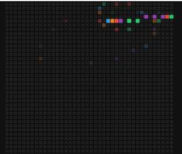|
|37| [Pokedex](https://github.com/xml12333/HTML_CSS_JS/tree/main/37.Pokedex)| [Demo](https://nikt.com.ua/projects/htmlCssJs/37.Pokedex/)| 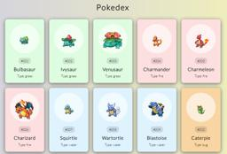|
|38| [Mobile Tab Navigation](https://github.com/xml12333/HTML_CSS_JS/tree/main/38.Mobile%20Tab%20Navigation)| [Demo](https://nikt.com.ua/projects/htmlCssJs/38.Mobile%20Tab%20Navigation/)| |
|39| [Password Strength Background](https://github.com/xml12333/HTML_CSS_JS/tree/main/39.Password%20Strength%20Background)| [Demo](https://nikt.com.ua/projects/htmlCssJs/39.Password%20Strength%20Background/)| |
|40| [3D Background Boxes](https://github.com/xml12333/HTML_CSS_JS/tree/main/40.3D%20Background%20Boxes)| [Demo](https://nikt.com.ua/projects/htmlCssJs/40.3D%20Background%20Boxes/)| |
|41| [Verify Account UI](https://github.com/xml12333/HTML_CSS_JS/tree/main/41.Verify%20Account%20UI)| [Demo](https://nikt.com.ua/projects/htmlCssJs/41.Verify%20Account%20UI/)| |
|42| [Live User Filter](https://github.com/xml12333/HTML_CSS_JS/tree/main/42.Live%20User%20Filter)| [Demo](https://nikt.com.ua/projects/htmlCssJs/42.Live%20User%20Filter/)| |
|43| [Feedback UI Design](https://github.com/xml12333/HTML_CSS_JS/tree/main/43.Feedback%20UI%20Design)| [Demo](https://nikt.com.ua/projects/htmlCssJs/43.Feedback%20UI%20Design/)| |
|44| [Custom Range Slider](https://github.com/xml12333/HTML_CSS_JS/tree/main/44.Custom%20Range%20Slider)| [Demo](https://nikt.com.ua/projects/htmlCssJs/44.Custom%20Range%20Slider/)| |
|45| [Netflix Navigation](https://github.com/xml12333/HTML_CSS_JS/tree/main/45.Netflix%20Navigation)| [Demo](https://nikt.com.ua/projects/htmlCssJs/45.Netflix%20Navigation/)| |
|46| [Quiz App](https://github.com/xml12333/HTML_CSS_JS/tree/main/46.Quiz%20App)| [Demo](https://nikt.com.ua/projects/htmlCssJs/46.Quiz%20App/)| |
|47| [Testimonial Box Switcher](https://github.com/xml12333/HTML_CSS_JS/tree/main/47.Testimonial%20Box%20Switcher)| [Demo](https://nikt.com.ua/projects/htmlCssJs/47.Testimonial%20Box%20Switcher/)| |
|48| [Random Image Feed](https://github.com/xml12333/HTML_CSS_JS/tree/main/48.Random%20Image%20Feed)| [Demo](https://nikt.com.ua/projects/htmlCssJs/48.Random%20Image%20Feed/)| |
|49| [Todo List](https://github.com/xml12333/HTML_CSS_JS/tree/main/49.Todo%20List)| [Demo](https://nikt.com.ua/projects/htmlCssJs/49.Todo%20List/)| |
|50| [Insect Catch Game](https://github.com/xml12333/HTML_CSS_JS/tree/main/50.Insect%20Catch%20Game)| [Demo](https://nikt.com.ua/projects/htmlCssJs/50.Insect%20Catch%20Game/)| |
|51| [hamburger](https://github.com/xml12333/HTML_CSS_JS/tree/main/51.hamburger)| [Demo](https://nikt.com.ua/projects/htmlCssJs/51.hamburger/)| |
|52| [toast-notification](https://github.com/xml12333/HTML_CSS_JS/tree/main/52.toast-notification)| [Demo](https://nikt.com.ua/projects/htmlCssJs/52.toast-notification/)| |
|53| [Light_Dark Theme Toggle](https://github.com/xml12333/HTML_CSS_JS/tree/main/53.Light_Dark%20Theme%20Toggle)| [Demo](https://nikt.com.ua/projects/htmlCssJs/53.Light_Dark%20Theme%20Toggle/)| |
|54| [Auto Write Text](https://github.com/xml12333/HTML_CSS_JS/tree/main/54.Auto%20Write%20Text)| [Demo](https://nikt.com.ua/projects/htmlCssJs/54.Auto%20Write%20Text/)| |
|55| [Popup Modal](https://github.com/xml12333/HTML_CSS_JS/tree/main/55.Popup%20Modal)| [Demo](https://nikt.com.ua/projects/htmlCssJs/55.Popup%20Modal/)| |
|56| [ Purple Heart-rain](https://github.com/xml12333/HTML_CSS_JS/tree/main/56.%20Purple%20Heart-rain)| [Demo](https://nikt.com.ua/projects/htmlCssJs/56.%20Purple%20Heart-rain/)| |
|57| [ Background Changer](https://github.com/xml12333/HTML_CSS_JS/tree/main/57.%20Background%20Changer)| [Demo](https://nikt.com.ua/projects/htmlCssJs/57.%20Background%20Changer/)| |
|58| [ Dark Mode Toggle](https://github.com/xml12333/HTML_CSS_JS/tree/main/58.%20Dark%20Mode%20Toggle)| [Demo](https://nikt.com.ua/projects/htmlCssJs/58.%20Dark%20Mode%20Toggle/)| |
|59| [Carousel](https://github.com/xml12333/HTML_CSS_JS/tree/main/59.Carousel)| [Demo](https://nikt.com.ua/projects/htmlCssJs/59.Carousel/)| 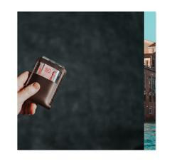|
|60| [Sound Board](https://github.com/xml12333/HTML_CSS_JS/tree/main/60.Sound%20Board)| [Demo](https://nikt.com.ua/projects/htmlCssJs/60.Sound%20Board/)| |
|61| [Zoom effect](https://github.com/xml12333/HTML_CSS_JS/tree/main/61.Zoom%20effect)| [Demo](https://nikt.com.ua/projects/htmlCssJs/61.Zoom%20effect/)| |
|62| [Automotive Car](https://github.com/xml12333/HTML_CSS_JS/tree/main/62.Automotive%20Car)| [Demo](https://nikt.com.ua/projects/htmlCssJs/62.Automotive%20Car/)| |
|63| [Restaurant Food](https://github.com/xml12333/HTML_CSS_JS/tree/main/63.Restaurant%20Food)| [Demo](https://nikt.com.ua/projects/htmlCssJs/63.Restaurant%20Food/)| |
|64| [Shoes Footwear](https://github.com/xml12333/HTML_CSS_JS/tree/main/64.Shoes%20Footwear)| [Demo](https://nikt.com.ua/projects/htmlCssJs/64.Shoes%20Footwear/)| |
|65| [Fashion Style](https://github.com/xml12333/HTML_CSS_JS/tree/main/65.Fashion%20Style)| [Demo](https://nikt.com.ua/projects/htmlCssJs/65.Fashion%20Style/)| |
|66| [Tourism Landscape](https://github.com/xml12333/HTML_CSS_JS/tree/main/66.Tourism%20Landscape)| [Demo](https://nikt.com.ua/projects/htmlCssJs/66.Tourism%20Landscape/)| |
|67| [News Magazine](https://github.com/xml12333/HTML_CSS_JS/tree/main/67.News%20Magazine)| [Demo](https://nikt.com.ua/projects/htmlCssJs/67.News%20Magazine/)| |
|68| [Legal Law](https://github.com/xml12333/HTML_CSS_JS/tree/main/68.Legal%20Law)| [Demo](https://nikt.com.ua/projects/htmlCssJs/68.Legal%20Law/)| |
|69| [TV Video Streaming](https://github.com/xml12333/HTML_CSS_JS/tree/main/69.TV%20Video%20Streaming)| [Demo](https://nikt.com.ua/projects/htmlCssJs/69.TV%20Video%20Streaming/)| |
|70| [Heart Shape](https://github.com/xml12333/HTML_CSS_JS/tree/main/70.Heart%20Shape)| [Demo](https://nikt.com.ua/projects/htmlCssJs/70.Heart%20Shape/)| |
|71| [Donate Card](https://github.com/xml12333/HTML_CSS_JS/tree/main/71.Donate%20Card)| [Demo](https://nikt.com.ua/projects/htmlCssJs/71.Donate%20Card/)| |
|72| [Technology IT](https://github.com/xml12333/HTML_CSS_JS/tree/main/72.Technology%20IT)| [Demo](https://nikt.com.ua/projects/htmlCssJs/72.Technology%20IT/)| |
|73| [Portfolio Resume](https://github.com/xml12333/HTML_CSS_JS/tree/main/73.Portfolio%20Resume)| [Demo](https://nikt.com.ua/projects/htmlCssJs/73.Portfolio%20Resume/)| |
|74| [Countdown timer](https://github.com/xml12333/HTML_CSS_JS/tree/main/74.Countdown%20timer)| [Demo](https://nikt.com.ua/projects/htmlCssJs/74.Countdown%20timer/)| |
|75| [Recipe App](https://github.com/xml12333/HTML_CSS_JS/tree/main/75.Recipe%20App)| [Demo](https://nikt.com.ua/projects/htmlCssJs/75.Recipe%20App/)| |
|76| [Weather App](https://github.com/xml12333/HTML_CSS_JS/tree/main/76.Weather%20App)| [Demo](https://nikt.com.ua/projects/htmlCssJs/76.Weather%20App/)| |
|77| [Mobile Navbar](https://github.com/xml12333/HTML_CSS_JS/tree/main/77.Mobile%20Navbar)| [Demo](https://nikt.com.ua/projects/htmlCssJs/77.Mobile%20Navbar/)| |
|78| [Animated Banner](https://github.com/xml12333/HTML_CSS_JS/tree/main/78.Animated%20Banner)| [Demo](https://nikt.com.ua/projects/htmlCssJs/78.Animated%20Banner/)| |
|79| [Profile Card](https://github.com/xml12333/HTML_CSS_JS/tree/main/79.Profile%20Card)| [Demo](https://nikt.com.ua/projects/htmlCssJs/79.Profile%20Card/)| |
|80| [Search with Dropdown](https://github.com/xml12333/HTML_CSS_JS/tree/main/80.Search%20with%20Dropdown)| [Demo](https://nikt.com.ua/projects/htmlCssJs/80.Search%20with%20Dropdown/)| |
|81| [Navbar Menu](https://github.com/xml12333/HTML_CSS_JS/tree/main/81.Navbar%20Menu)| [Demo](https://nikt.com.ua/projects/htmlCssJs/81.Navbar%20Menu/)| |
|82| [3D Button](https://github.com/xml12333/HTML_CSS_JS/tree/main/82.3D%20Button)| [Demo](https://nikt.com.ua/projects/htmlCssJs/82.3D%20Button/)| |
|83| [Mobile Product Screen](https://github.com/xml12333/HTML_CSS_JS/tree/main/83.Mobile%20Product%20Screen)| [Demo](https://nikt.com.ua/projects/htmlCssJs/83.Mobile%20Product%20Screen/)| |
|84| [Bikes Website](https://github.com/xml12333/HTML_CSS_JS/tree/main/84.Bikes%20Website)| [Demo](https://nikt.com.ua/projects/htmlCssJs/84.Bikes%20Website/)| |
|85| [Interactive Menu](https://github.com/xml12333/HTML_CSS_JS/tree/main/85.Interactive%20Menu)| [Demo](https://nikt.com.ua/projects/htmlCssJs/85.Interactive%20Menu/)| |
|86| [Search Bar](https://github.com/xml12333/HTML_CSS_JS/tree/main/86.Search%20Bar)| [Demo](https://nikt.com.ua/projects/htmlCssJs/86.Search%20Bar/)| |
|87| [Mobile Profile Page](https://github.com/xml12333/HTML_CSS_JS/tree/main/87.Mobile%20Profile%20Page)| [Demo](https://nikt.com.ua/projects/htmlCssJs/87.Mobile%20Profile%20Page/)| |
|88| [Skills Progress Bar](https://github.com/xml12333/HTML_CSS_JS/tree/main/88.Skills%20Progress%20Bar)| [Demo](https://nikt.com.ua/projects/htmlCssJs/88.Skills%20Progress%20Bar/)| |
|89| [Footer Design](https://github.com/xml12333/HTML_CSS_JS/tree/main/89.Footer%20Design)| [Demo](https://nikt.com.ua/projects/htmlCssJs/89.Footer%20Design/)| |
|90| [Accordion Design](https://github.com/xml12333/HTML_CSS_JS/tree/main/90.Accordion%20Design)| [Demo](https://nikt.com.ua/projects/htmlCssJs/90.Accordion%20Design/)| |
|91| [Website Festival Event](https://github.com/xml12333/HTML_CSS_JS/tree/main/91.Website%20Festival%20Event)| [Demo](https://nikt.com.ua/projects/htmlCssJs/91.Website%20Festival%20Event/)| |
|92| [Website Header](https://github.com/xml12333/HTML_CSS_JS/tree/main/92.Website%20Header)| [Demo](https://nikt.com.ua/projects/htmlCssJs/92.Website%20Header/)| |
|93| [Auto Typing Effect](https://github.com/xml12333/HTML_CSS_JS/tree/main/93.Auto%20Typing%20Effect)| [Demo](https://nikt.com.ua/projects/htmlCssJs/93.Auto%20Typing%20Effect/)| |
|94| [Image Hover Effect](https://github.com/xml12333/HTML_CSS_JS/tree/main/94.Image%20Hover%20Effect)| [Demo](https://nikt.com.ua/projects/htmlCssJs/94.Image%20Hover%20Effect/)| |
|95| [Location Map On Website](https://github.com/xml12333/HTML_CSS_JS/tree/main/95.Location%20Map%20On%20Website)| [Demo](https://nikt.com.ua/projects/htmlCssJs/95.Location%20Map%20On%20Website/)| |
|96| [PopUp Box](https://github.com/xml12333/HTML_CSS_JS/tree/main/96.PopUp%20Box)| [Demo](https://nikt.com.ua/projects/htmlCssJs/96.PopUp%20Box/)| |
|97| [Neumorphism Button](https://github.com/xml12333/HTML_CSS_JS/tree/main/97.Neumorphism%20Button)| [Demo](https://nikt.com.ua/projects/htmlCssJs/97.Neumorphism%20Button/)| |
|98| [Glassmorphism Profile](https://github.com/xml12333/HTML_CSS_JS/tree/main/98.Glassmorphism%20Profile)| [Demo](https://nikt.com.ua/projects/htmlCssJs/98.Glassmorphism%20Profile/)| |
|99| [Video on Background](https://github.com/xml12333/HTML_CSS_JS/tree/main/99.Video%20on%20Background)| [Demo](https://nikt.com.ua/projects/htmlCssJs/99.Video%20on%20Background/)| |
|100| [Flip Card Profile](https://github.com/xml12333/HTML_CSS_JS/tree/main/100.Flip%20Card%20Profile)| [Demo](https://nikt.com.ua/projects/htmlCssJs/100.Flip%20Card%20Profile/)| |
|101| [Form Validator](https://github.com/xml12333/HTML_CSS_JS/tree/main/101.Form%20Validator)| [Demo](https://nikt.com.ua/projects/htmlCssJs/101.Form%20Validator/)| |
|102| [Movie Seat Booking  DOM with Local Storage](https://github.com/xml12333/HTML_CSS_JS/tree/main/102.Movie%20Seat%20Booking%20%20DOM%20with%20Local%20Storage)| [Demo](https://nikt.com.ua/projects/htmlCssJs/102.Movie%20Seat%20Booking%20%20DOM%20with%20Local%20Storage/)| |
|103| [Custom Video Player  HTML5 Video API](https://github.com/xml12333/HTML_CSS_JS/tree/main/103.Custom%20Video%20Player%20%20HTML5%20Video%20API)| [Demo](https://nikt.com.ua/projects/htmlCssJs/103.Custom%20Video%20Player%20%20HTML5%20Video%20API/)| |
|104| [Exchange Rate Calculator  Fetch_with_JSON Intro](https://github.com/xml12333/HTML_CSS_JS/tree/main/104.Exchange%20Rate%20Calculator%20%20Fetch_with_JSON%20Intro)| [Demo](https://nikt.com.ua/projects/htmlCssJs/104.Exchange%20Rate%20Calculator%20%20Fetch_with_JSON%20Intro/)| |
|105| [DOM Array Methods  forEach, map, filter, sort, reduce](https://github.com/xml12333/HTML_CSS_JS/tree/main/105.DOM%20Array%20Methods%20%20forEach,%20map,%20filter,%20sort,%20reduce)| [Demo](https://nikt.com.ua/projects/htmlCssJs/105.DOM%20Array%20Methods%20%20forEach,%20map,%20filter,%20sort,%20reduce/)| |
|106| [Menu Slider and Modal  DOM and CSS](https://github.com/xml12333/HTML_CSS_JS/tree/main/106.Menu%20Slider%20and%20Modal%20%20DOM%20and%20CSS)| [Demo](https://nikt.com.ua/projects/htmlCssJs/106.Menu%20Slider%20and%20Modal%20%20DOM%20and%20CSS/)| |
|107| [Hangman Game  DOM, SVG, Events](https://github.com/xml12333/HTML_CSS_JS/tree/main/107.Hangman%20Game%20%20DOM,%20SVG,%20Events)| [Demo](https://nikt.com.ua/projects/htmlCssJs/107.Hangman%20Game%20%20DOM,%20SVG,%20Events/)| |
|108| [Meal Finder  Fetch and MealDB API](https://github.com/xml12333/HTML_CSS_JS/tree/main/108.Meal%20Finder%20%20Fetch%20and%20MealDB%20API)| [Demo](https://nikt.com.ua/projects/htmlCssJs/108.Meal%20Finder%20%20Fetch%20and%20MealDB%20API/)| |
|109| [Expense Tracker  Array Methods and Local Storage](https://github.com/xml12333/HTML_CSS_JS/tree/main/109.Expense%20Tracker%20%20Array%20Methods%20and%20Local%20Storage)| [Demo](https://nikt.com.ua/projects/htmlCssJs/109.Expense%20Tracker%20%20Array%20Methods%20and%20Local%20Storage/)| |
|110| [Music Player HTML5 Audio API](https://github.com/xml12333/HTML_CSS_JS/tree/main/110.Music%20Player%20HTML5%20Audio%20API)| [Demo](https://nikt.com.ua/projects/htmlCssJs/110.Music%20Player%20HTML5%20Audio%20API/)| |
|111| [Infinite Scroll Posts  Fetch, AsyncAwait, CSS Loader](https://github.com/xml12333/HTML_CSS_JS/tree/main/111.Infinite%20Scroll%20Posts%20%20Fetch,%20AsyncAwait,%20CSS%20Loader)| [Demo](https://nikt.com.ua/projects/htmlCssJs/111.Infinite%20Scroll%20Posts%20%20Fetch,%20AsyncAwait,%20CSS%20Loader/)| |
|112| [Typing Game  DOM, Intervals, Events](https://github.com/xml12333/HTML_CSS_JS/tree/main/112.Typing%20Game%20%20DOM,%20Intervals,%20Events)| [Demo](https://nikt.com.ua/projects/htmlCssJs/112.Typing%20Game%20%20DOM,%20Intervals,%20Events/)| |
|113| [Speech Text Reader  Speech Synthesis](https://github.com/xml12333/HTML_CSS_JS/tree/main/113.Speech%20Text%20Reader%20%20Speech%20Synthesis)| [Demo](https://nikt.com.ua/projects/htmlCssJs/113.Speech%20Text%20Reader%20%20Speech%20Synthesis/)| |
|114| [Memory Cards  CSS Effects, Local Storage](https://github.com/xml12333/HTML_CSS_JS/tree/main/114.Memory%20Cards%20%20CSS%20Effects,%20Local%20Storage)| [Demo](https://nikt.com.ua/projects/htmlCssJs/114.Memory%20Cards%20%20CSS%20Effects,%20Local%20Storage/)| |
|115| [Lyrics Search App  Fetch, Pagination, Lyrics](https://github.com/xml12333/HTML_CSS_JS/tree/main/115.Lyrics%20Search%20App%20%20Fetch,%20Pagination,%20Lyrics)| [Demo](https://nikt.com.ua/projects/htmlCssJs/115.Lyrics%20Search%20App%20%20Fetch,%20Pagination,%20Lyrics/)| |
|116| [Relaxer App  CSS Animations, setTimeout](https://github.com/xml12333/HTML_CSS_JS/tree/main/116.Relaxer%20App%20%20CSS%20Animations,%20setTimeout)| [Demo](https://nikt.com.ua/projects/htmlCssJs/116.Relaxer%20App%20%20CSS%20Animations,%20setTimeout/)| |
|117| [Breakout Game  HTML5 Canvas API](https://github.com/xml12333/HTML_CSS_JS/tree/main/117.Breakout%20Game%20%20HTML5%20Canvas%20API)| [Demo](https://nikt.com.ua/projects/htmlCssJs/117.Breakout%20Game%20%20HTML5%20Canvas%20API/)| |
|118| [New Year Countdown  DOM, Date and Time](https://github.com/xml12333/HTML_CSS_JS/tree/main/118.New%20Year%20Countdown%20%20DOM,%20Date%20and%20Time)| [Demo](https://nikt.com.ua/projects/htmlCssJs/118.New%20Year%20Countdown%20%20DOM,%20Date%20and%20Time/)| |
|119| [Sortable List  Drag and Drop API](https://github.com/xml12333/HTML_CSS_JS/tree/main/119.Sortable%20List%20%20Drag%20and%20Drop%20API)| [Demo](https://nikt.com.ua/projects/htmlCssJs/119.Sortable%20List%20%20Drag%20and%20Drop%20API/)| |
|120| [Speak Number Guessing Game  Speech Recognition](https://github.com/xml12333/HTML_CSS_JS/tree/main/120.Speak%20Number%20Guessing%20Game%20%20Speech%20Recognition)| [Demo](https://nikt.com.ua/projects/htmlCssJs/120.Speak%20Number%20Guessing%20Game%20%20Speech%20Recognition/)| |
|121| [Dropdown](https://github.com/xml12333/HTML_CSS_JS/tree/main/121.Dropdown)| [Demo](https://nikt.com.ua/projects/htmlCssJs/121.Dropdown/)| |
|122| [Presentation_website](https://github.com/xml12333/HTML_CSS_JS/tree/main/122.Presentation_website)| [Demo](https://nikt.com.ua/projects/htmlCssJs/122.Presentation_website/)| |
|123| [Knowledge_resume](https://github.com/xml12333/HTML_CSS_JS/tree/main/123.Knowledge_resume)| [Demo](https://nikt.com.ua/projects/htmlCssJs/123.Knowledge_resume/)| 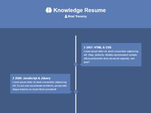|
|124| [Edgeledger_website](https://github.com/xml12333/HTML_CSS_JS/tree/main/124.Edgeledger_website)| [Demo](https://nikt.com.ua/projects/htmlCssJs/124.Edgeledger_website/)| |
|125| [Newsgrid](https://github.com/xml12333/HTML_CSS_JS/tree/main/125.Newsgrid)| [Demo](https://nikt.com.ua/projects/htmlCssJs/125.Newsgrid/)| |
|126| [Portfolio_website](https://github.com/xml12333/HTML_CSS_JS/tree/main/126.Portfolio_website)| [Demo](https://nikt.com.ua/projects/htmlCssJs/126.Portfolio_website/)| |
|127| [Tasklist](https://github.com/xml12333/HTML_CSS_JS/tree/main/127.Tasklist)| [Demo](https://nikt.com.ua/projects/htmlCssJs/127.Tasklist/)| |
|128| [Loancalculator](https://github.com/xml12333/HTML_CSS_JS/tree/main/128.Loancalculator)| [Demo](https://nikt.com.ua/projects/htmlCssJs/128.Loancalculator/)| |
|129| [Numberguesser](https://github.com/xml12333/HTML_CSS_JS/tree/main/129.Numberguesser)| [Demo](https://nikt.com.ua/projects/htmlCssJs/129.Numberguesser/)| |
|130| [Book List UI](https://github.com/xml12333/HTML_CSS_JS/tree/main/130.Book%20List%20UI)| [Demo](https://nikt.com.ua/projects/htmlCssJs/130.Book%20List%20UI/)| |
|131| [Github Finder](https://github.com/xml12333/HTML_CSS_JS/tree/main/131.Github%20Finder)| [Demo](https://nikt.com.ua/projects/htmlCssJs/131.Github%20Finder/)| |
|132| [WeatherJS](https://github.com/xml12333/HTML_CSS_JS/tree/main/132.WeatherJS)| [Demo](https://nikt.com.ua/projects/htmlCssJs/132.WeatherJS/)| 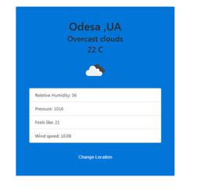|
|133| [RegEx Form Validataion](https://github.com/xml12333/HTML_CSS_JS/tree/main/133.RegEx%20Form%20Validataion)| [Demo](https://nikt.com.ua/projects/htmlCssJs/133.RegEx%20Form%20Validataion/)| |
|134| [ Iterator Profile Scroller](https://github.com/xml12333/HTML_CSS_JS/tree/main/134.%20Iterator%20Profile%20Scroller)| [Demo](https://nikt.com.ua/projects/htmlCssJs/134.%20Iterator%20Profile%20Scroller/)| |
|135| [Tracalorie](https://github.com/xml12333/HTML_CSS_JS/tree/main/135.Tracalorie)| [Demo](https://nikt.com.ua/projects/htmlCssJs/135.Tracalorie/)| 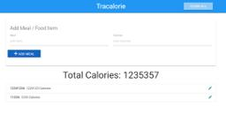|
|136| [MicroPosts](https://github.com/xml12333/HTML_CSS_JS/tree/main/136.MicroPosts)| [Demo](https://nikt.com.ua/projects/htmlCssJs/136.MicroPosts/)| |
|137| [Animated Hover Website](https://github.com/xml12333/HTML_CSS_JS/tree/main/137.Animated%20Hover%20Website)| [Demo](https://nikt.com.ua/projects/htmlCssJs/137.Animated%20Hover%20Website/)| |
|138| [Product Website](https://github.com/xml12333/HTML_CSS_JS/tree/main/138.Product%20Website)| [Demo](https://nikt.com.ua/projects/htmlCssJs/138.Product%20Website/)| |
|139| [Property Website](https://github.com/xml12333/HTML_CSS_JS/tree/main/139.Property%20Website)| [Demo](https://nikt.com.ua/projects/htmlCssJs/139.Property%20Website/)| |
|140| [Hover on Icon](https://github.com/xml12333/HTML_CSS_JS/tree/main/140.Hover%20on%20Icon)| [Demo](https://nikt.com.ua/projects/htmlCssJs/140.Hover%20on%20Icon/)| |
|141| [Portfolio Website](https://github.com/xml12333/HTML_CSS_JS/tree/main/141.Portfolio%20Website)| [Demo](https://nikt.com.ua/projects/htmlCssJs/141.Portfolio%20Website/)| |
|142| [Testimonial Slider](https://github.com/xml12333/HTML_CSS_JS/tree/main/142.Testimonial%20Slider)| [Demo](https://nikt.com.ua/projects/htmlCssJs/142.Testimonial%20Slider/)| |
|143| [Animated Button](https://github.com/xml12333/HTML_CSS_JS/tree/main/143.Animated%20Button)| [Demo](https://nikt.com.ua/projects/htmlCssJs/143.Animated%20Button/)| |
|144| [Animated SearchBox](https://github.com/xml12333/HTML_CSS_JS/tree/main/144.Animated%20SearchBox)| [Demo](https://nikt.com.ua/projects/htmlCssJs/144.Animated%20SearchBox/)| |
|145| [Select Menu](https://github.com/xml12333/HTML_CSS_JS/tree/main/145.Select%20Menu)| [Demo](https://nikt.com.ua/projects/htmlCssJs/145.Select%20Menu/)| |
|146| [Boat Animation](https://github.com/xml12333/HTML_CSS_JS/tree/main/146.Boat%20Animation)| [Demo](https://nikt.com.ua/projects/htmlCssJs/146.Boat%20Animation/)| |
|147| [Marketing Agency Website](https://github.com/xml12333/HTML_CSS_JS/tree/main/147.Marketing%20Agency%20Website)| [Demo](https://nikt.com.ua/projects/htmlCssJs/147.Marketing%20Agency%20Website/)| |
|148| [Image Gallery JQuery](https://github.com/xml12333/HTML_CSS_JS/tree/main/148.Image%20Gallery%20JQuery)| [Demo](https://nikt.com.ua/projects/htmlCssJs/148.Image%20Gallery%20JQuery/)| |
|149| [Urban Fashion Website](https://github.com/xml12333/HTML_CSS_JS/tree/main/149.Urban%20Fashion%20Website)| [Demo](https://nikt.com.ua/projects/htmlCssJs/149.Urban%20Fashion%20Website/)| |
|150| [ Hero Animation](https://github.com/xml12333/HTML_CSS_JS/tree/main/150.%20Hero%20Animation)| [Demo](https://nikt.com.ua/projects/htmlCssJs/150.%20Hero%20Animation/)| |
|151| [Price Card](https://github.com/xml12333/HTML_CSS_JS/tree/main/151.Price%20Card)| [Demo](https://nikt.com.ua/projects/htmlCssJs/151.Price%20Card/)| |
|152| [Password Strength](https://github.com/xml12333/HTML_CSS_JS/tree/main/152.Password%20Strength)| [Demo](https://nikt.com.ua/projects/htmlCssJs/152.Password%20Strength/)| |
|153| [Form Validation](https://github.com/xml12333/HTML_CSS_JS/tree/main/153.Form%20Validation)| [Demo](https://nikt.com.ua/projects/htmlCssJs/153.Form%20Validation/)| |
|154| [Side Nav Menu](https://github.com/xml12333/HTML_CSS_JS/tree/main/154.Side%20Nav%20Menu)| [Demo](https://nikt.com.ua/projects/htmlCssJs/154.Side%20Nav%20Menu/)| |
|155| [Image Slider](https://github.com/xml12333/HTML_CSS_JS/tree/main/155.Image%20Slider)| [Demo](https://nikt.com.ua/projects/htmlCssJs/155.Image%20Slider/)| |
|156| [Time On Website](https://github.com/xml12333/HTML_CSS_JS/tree/main/156.Time%20On%20Website)| [Demo](https://nikt.com.ua/projects/htmlCssJs/156.Time%20On%20Website/)| |
|157| [Search Bar](https://github.com/xml12333/HTML_CSS_JS/tree/main/157.Search%20Bar)| [Demo](https://nikt.com.ua/projects/htmlCssJs/157.Search%20Bar/)| |
|158| [Responsive Registration Form](https://github.com/xml12333/HTML_CSS_JS/tree/main/158.Responsive%20Registration%20Form)| [Demo](https://nikt.com.ua/projects/htmlCssJs/158.Responsive%20Registration%20Form/)| |
|159| [3D Flip Card](https://github.com/xml12333/HTML_CSS_JS/tree/main/159.3D%20Flip%20Card)| [Demo](https://nikt.com.ua/projects/htmlCssJs/159.3D%20Flip%20Card/)| |
|160| [Video Calling UI](https://github.com/xml12333/HTML_CSS_JS/tree/main/160.Video%20Calling%20UI)| [Demo](https://nikt.com.ua/projects/htmlCssJs/160.Video%20Calling%20UI/)| |
|161| [Animated Menu Icon](https://github.com/xml12333/HTML_CSS_JS/tree/main/161.Animated%20Menu%20Icon)| [Demo](https://nikt.com.ua/projects/htmlCssJs/161.Animated%20Menu%20Icon/)| |
|162| [Tesla Website](https://github.com/xml12333/HTML_CSS_JS/tree/main/162.Tesla%20Website)| [Demo](https://nikt.com.ua/projects/htmlCssJs/162.Tesla%20Website/)| |
|163| [Cupon Code](https://github.com/xml12333/HTML_CSS_JS/tree/main/163.Cupon%20Code)| [Demo](https://nikt.com.ua/projects/htmlCssJs/163.Cupon%20Code/)| |
|164| [Cryptocurrency Price](https://github.com/xml12333/HTML_CSS_JS/tree/main/164.Cryptocurrency%20Price)| [Demo](https://nikt.com.ua/projects/htmlCssJs/164.Cryptocurrency%20Price/)| |
|165| [Contact Form](https://github.com/xml12333/HTML_CSS_JS/tree/main/165.Contact%20Form)| [Demo](https://nikt.com.ua/projects/htmlCssJs/165.Contact%20Form/)| |
|166| [Profile Card](https://github.com/xml12333/HTML_CSS_JS/tree/main/166.Profile%20Card)| [Demo](https://nikt.com.ua/projects/htmlCssJs/166.Profile%20Card/)| |
|167| [Animated SVGText](https://github.com/xml12333/HTML_CSS_JS/tree/main/167.Animated%20SVGText)| [Demo](https://nikt.com.ua/projects/htmlCssJs/167.Animated%20SVGText/)| |
|168| [Landing Page](https://github.com/xml12333/HTML_CSS_JS/tree/main/168.Landing%20Page)| [Demo](https://nikt.com.ua/projects/htmlCssJs/168.Landing%20Page/)| |
|169| [Sticky NavBar](https://github.com/xml12333/HTML_CSS_JS/tree/main/169.Sticky%20NavBar)| [Demo](https://nikt.com.ua/projects/htmlCssJs/169.Sticky%20NavBar/)| |
|170| [Menu Design](https://github.com/xml12333/HTML_CSS_JS/tree/main/170.Menu%20Design)| [Demo](https://nikt.com.ua/projects/htmlCssJs/170.Menu%20Design/)| |
|171| [AutoTyping Text on Website](https://github.com/xml12333/HTML_CSS_JS/tree/main/171.AutoTyping%20Text%20on%20Website)| [Demo](https://nikt.com.ua/projects/htmlCssJs/171.AutoTyping%20Text%20on%20Website/)| |
|172| [Interactive Feedback](https://github.com/xml12333/HTML_CSS_JS/tree/main/172.Interactive%20Feedback)| [Demo](https://nikt.com.ua/projects/htmlCssJs/172.Interactive%20Feedback/)| |
|173| [ChatBox UI](https://github.com/xml12333/HTML_CSS_JS/tree/main/173.ChatBox%20UI)| [Demo](https://nikt.com.ua/projects/htmlCssJs/173.ChatBox%20UI/)| |
|174| [Adventure Design](https://github.com/xml12333/HTML_CSS_JS/tree/main/174.Adventure%20Design)| [Demo](https://nikt.com.ua/projects/htmlCssJs/174.Adventure%20Design/)| |
|175| [Personal Website Design](https://github.com/xml12333/HTML_CSS_JS/tree/main/175.Personal%20Website%20Design)| [Demo](https://nikt.com.ua/projects/htmlCssJs/175.Personal%20Website%20Design/)| |
|176| [Lightbox Gallery](https://github.com/xml12333/HTML_CSS_JS/tree/main/176.Lightbox%20Gallery)| [Demo](https://nikt.com.ua/projects/htmlCssJs/176.Lightbox%20Gallery/)| |
|177| [Piramid](https://github.com/xml12333/HTML_CSS_JS/tree/main/177.Piramid)| [Demo](https://nikt.com.ua/projects/htmlCssJs/177.Piramid/)| 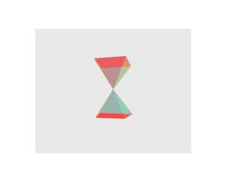|
|178| [Service Section](https://github.com/xml12333/HTML_CSS_JS/tree/main/178.Service%20Section)| [Demo](https://nikt.com.ua/projects/htmlCssJs/178.Service%20Section/)| |
|179| [Password Strength](https://github.com/xml12333/HTML_CSS_JS/tree/main/179.Password%20Strength)| [Demo](https://nikt.com.ua/projects/htmlCssJs/179.Password%20Strength/)| |
|180| [Comming Soon Page](https://github.com/xml12333/HTML_CSS_JS/tree/main/180.Comming%20Soon%20Page)| [Demo](https://nikt.com.ua/projects/htmlCssJs/180.Comming%20Soon%20Page/)| |
|181| [Animated Text](https://github.com/xml12333/HTML_CSS_JS/tree/main/181.Animated%20Text)| [Demo](https://nikt.com.ua/projects/htmlCssJs/181.Animated%20Text/)| |
|182| [Text Animation](https://github.com/xml12333/HTML_CSS_JS/tree/main/182.Text%20Animation)| [Demo](https://nikt.com.ua/projects/htmlCssJs/182.Text%20Animation/)| |
|183| [Blur Mask Website](https://github.com/xml12333/HTML_CSS_JS/tree/main/183.Blur%20Mask%20Website)| [Demo](https://nikt.com.ua/projects/htmlCssJs/183.Blur%20Mask%20Website/)| |
|184| [Create Logo](https://github.com/xml12333/HTML_CSS_JS/tree/main/184.Create%20Logo)| [Demo](https://nikt.com.ua/projects/htmlCssJs/184.Create%20Logo/)| |
|185| [Plane Animation](https://github.com/xml12333/HTML_CSS_JS/tree/main/185.Plane%20Animation)| [Demo](https://nikt.com.ua/projects/htmlCssJs/185.Plane%20Animation/)| |
|186| [Modern Design](https://github.com/xml12333/HTML_CSS_JS/tree/main/186.Modern%20Design)| [Demo](https://nikt.com.ua/projects/htmlCssJs/186.Modern%20Design/)| |
|187| [Gif Background](https://github.com/xml12333/HTML_CSS_JS/tree/main/187.Gif%20Background)| [Demo](https://nikt.com.ua/projects/htmlCssJs/187.Gif%20Background/)| |
|188| [Credit Card Design](https://github.com/xml12333/HTML_CSS_JS/tree/main/188.Credit%20Card%20Design)| [Demo](https://nikt.com.ua/projects/htmlCssJs/188.Credit%20Card%20Design/)| |
|189| [Video on Text Background](https://github.com/xml12333/HTML_CSS_JS/tree/main/189.Video%20on%20Text%20Background)| [Demo](https://nikt.com.ua/projects/htmlCssJs/189.Video%20on%20Text%20Background/)| |
|190| [Circular Progress Bar](https://github.com/xml12333/HTML_CSS_JS/tree/main/190.Circular%20Progress%20Bar)| [Demo](https://nikt.com.ua/projects/htmlCssJs/190.Circular%20Progress%20Bar/)| |
|191| [Lamp Website](https://github.com/xml12333/HTML_CSS_JS/tree/main/191.Lamp%20Website)| [Demo](https://nikt.com.ua/projects/htmlCssJs/191.Lamp%20Website/)| |
|192| [eLearning Responsive Website](https://github.com/xml12333/HTML_CSS_JS/tree/main/192.eLearning%20Responsive%20Website)| [Demo](https://nikt.com.ua/projects/htmlCssJs/192.eLearning%20Responsive%20Website/)| |
|193| [Animated Footer](https://github.com/xml12333/HTML_CSS_JS/tree/main/193.Animated%20Footer)| [Demo](https://nikt.com.ua/projects/htmlCssJs/193.Animated%20Footer/)| |
|194| [Music Wave](https://github.com/xml12333/HTML_CSS_JS/tree/main/194.Music%20Wave)| [Demo](https://nikt.com.ua/projects/htmlCssJs/194.Music%20Wave/)| |
|195| [Image Gallery](https://github.com/xml12333/HTML_CSS_JS/tree/main/195.Image%20Gallery)| [Demo](https://nikt.com.ua/projects/htmlCssJs/195.Image%20Gallery/)| |
|196| [Contact Form](https://github.com/xml12333/HTML_CSS_JS/tree/main/196.Contact%20Form)| [Demo](https://nikt.com.ua/projects/htmlCssJs/196.Contact%20Form/)| |
|197| [Backgroud Change Effect](https://github.com/xml12333/HTML_CSS_JS/tree/main/197.Backgroud%20Change%20Effect)| [Demo](https://nikt.com.ua/projects/htmlCssJs/197.Backgroud%20Change%20Effect/)| |
|198| [Header Video Background](https://github.com/xml12333/HTML_CSS_JS/tree/main/198.Header%20Video%20Background)| [Demo](https://nikt.com.ua/projects/htmlCssJs/198.Header%20Video%20Background/)| |
|199| [Hover Effect on Icons](https://github.com/xml12333/HTML_CSS_JS/tree/main/199.Hover%20Effect%20on%20Icons)| [Demo](https://nikt.com.ua/projects/htmlCssJs/199.Hover%20Effect%20on%20Icons/)| |
|200| [Image Hover Effect](https://github.com/xml12333/HTML_CSS_JS/tree/main/200.Image%20Hover%20Effect)| [Demo](https://nikt.com.ua/projects/htmlCssJs/200.Image%20Hover%20Effect/)| |
|201| [PopUp Form](https://github.com/xml12333/HTML_CSS_JS/tree/main/201.PopUp%20Form)| [Demo](https://nikt.com.ua/projects/htmlCssJs/201.PopUp%20Form/)| |
|202| [Portfolio DarkMode Website](https://github.com/xml12333/HTML_CSS_JS/tree/main/202.Portfolio%20DarkMode%20Website)| [Demo](https://nikt.com.ua/projects/htmlCssJs/202.Portfolio%20DarkMode%20Website/)| |
|203| [Neumorphism Button](https://github.com/xml12333/HTML_CSS_JS/tree/main/203.Neumorphism%20Button)| [Demo](https://nikt.com.ua/projects/htmlCssJs/203.Neumorphism%20Button/)| |
|204| [Login and Registration Form](https://github.com/xml12333/HTML_CSS_JS/tree/main/204.Login%20and%20Registration%20Form)| [Demo](https://nikt.com.ua/projects/htmlCssJs/204.Login%20and%20Registration%20Form/)| |
|205| [Elastic Image Slider](https://github.com/xml12333/HTML_CSS_JS/tree/main/205.Elastic%20Image%20Slider)| [Demo](https://nikt.com.ua/projects/htmlCssJs/205.Elastic%20Image%20Slider/)| |
|206| [Animated Gradien Color Border](https://github.com/xml12333/HTML_CSS_JS/tree/main/206.Animated%20Gradien%20Color%20Border)| [Demo](https://nikt.com.ua/projects/htmlCssJs/206.Animated%20Gradien%20Color%20Border/)| |
|207| [Agency Website](https://github.com/xml12333/HTML_CSS_JS/tree/main/207.Agency%20Website)| [Demo](https://nikt.com.ua/projects/htmlCssJs/207.Agency%20Website/)| |
|207| [Testimonial Slider](https://github.com/xml12333/HTML_CSS_JS/tree/main/207.Testimonial%20Slider)| [Demo](https://nikt.com.ua/projects/htmlCssJs/207.Testimonial%20Slider/)| |
|208| [Neon Light](https://github.com/xml12333/HTML_CSS_JS/tree/main/208.Neon%20Light)| [Demo](https://nikt.com.ua/projects/htmlCssJs/208.Neon%20Light/)| |
|209| [StakeHouse Website](https://github.com/xml12333/HTML_CSS_JS/tree/main/209.StakeHouse%20Website)| [Demo](https://nikt.com.ua/projects/htmlCssJs/209.StakeHouse%20Website/)| |
|210| [Gradient Hover](https://github.com/xml12333/HTML_CSS_JS/tree/main/210.Gradient%20Hover)| [Demo](https://nikt.com.ua/projects/htmlCssJs/210.Gradient%20Hover/)| |
|211| [Stock Photo Website](https://github.com/xml12333/HTML_CSS_JS/tree/main/211.Stock%20Photo%20Website)| [Demo](https://nikt.com.ua/projects/htmlCssJs/211.Stock%20Photo%20Website/)| |
|212| [Email Signup Form](https://github.com/xml12333/HTML_CSS_JS/tree/main/212.Email%20Signup%20Form)| [Demo](https://nikt.com.ua/projects/htmlCssJs/212.Email%20Signup%20Form/)| |
|213| [Neon Text](https://github.com/xml12333/HTML_CSS_JS/tree/main/213.Neon%20Text)| [Demo](https://nikt.com.ua/projects/htmlCssJs/213.Neon%20Text/)| |
|214| [Music Website](https://github.com/xml12333/HTML_CSS_JS/tree/main/214.Music%20Website)| [Demo](https://nikt.com.ua/projects/htmlCssJs/214.Music%20Website/)| |
|215| [Email Subscription](https://github.com/xml12333/HTML_CSS_JS/tree/main/215.Email%20Subscription)| [Demo](https://nikt.com.ua/projects/htmlCssJs/215.Email%20Subscription/)| |
|216| [ Fruit Website](https://github.com/xml12333/HTML_CSS_JS/tree/main/216.%20Fruit%20Website)| [Demo](https://nikt.com.ua/projects/htmlCssJs/216.%20Fruit%20Website/)| |
|217| [House Design Website](https://github.com/xml12333/HTML_CSS_JS/tree/main/217.House%20Design%20Website)| [Demo](https://nikt.com.ua/projects/htmlCssJs/217.House%20Design%20Website/)| |
|218| [Button Effects](https://github.com/xml12333/HTML_CSS_JS/tree/main/218.Button%20Effects)| [Demo](https://nikt.com.ua/projects/htmlCssJs/218.Button%20Effects/)| |
|219| [Verse Website](https://github.com/xml12333/HTML_CSS_JS/tree/main/219.Verse%20Website)| [Demo](https://nikt.com.ua/projects/htmlCssJs/219.Verse%20Website/)| |
|220| [Esence Website](https://github.com/xml12333/HTML_CSS_JS/tree/main/220.Esence%20Website)| [Demo](https://nikt.com.ua/projects/htmlCssJs/220.Esence%20Website/)| |
|221| [Black and White Image](https://github.com/xml12333/HTML_CSS_JS/tree/main/221.Black%20and%20White%20Image)| [Demo](https://nikt.com.ua/projects/htmlCssJs/221.Black%20and%20White%20Image/)| |
|222| [Discover Website](https://github.com/xml12333/HTML_CSS_JS/tree/main/222.Discover%20Website)| [Demo](https://nikt.com.ua/projects/htmlCssJs/222.Discover%20Website/)| |
|223| [Animated Profile Card](https://github.com/xml12333/HTML_CSS_JS/tree/main/223.Animated%20Profile%20Card)| [Demo](https://nikt.com.ua/projects/htmlCssJs/223.Animated%20Profile%20Card/)| |
|224| [Sidebar Responsive](https://github.com/xml12333/HTML_CSS_JS/tree/main/224.Sidebar%20Responsive)| [Demo](https://nikt.com.ua/projects/htmlCssJs/224.Sidebar%20Responsive/)| |
|225| [Neon Photograpy Website](https://github.com/xml12333/HTML_CSS_JS/tree/main/225.Neon%20Photograpy%20Website)| [Demo](https://nikt.com.ua/projects/htmlCssJs/225.Neon%20Photograpy%20Website/)| |
|226| [PS4 Responsive Website](https://github.com/xml12333/HTML_CSS_JS/tree/main/226.PS4%20Responsive%20Website)| [Demo](https://nikt.com.ua/projects/htmlCssJs/226.PS4%20Responsive%20Website/)| |
|227| [Identity Card](https://github.com/xml12333/HTML_CSS_JS/tree/main/227.Identity%20Card)| [Demo](https://nikt.com.ua/projects/htmlCssJs/227.Identity%20Card/)| |
|228| [Image Gallery](https://github.com/xml12333/HTML_CSS_JS/tree/main/228.Image%20Gallery)| [Demo](https://nikt.com.ua/projects/htmlCssJs/228.Image%20Gallery/)| |
|229| [Car Website](https://github.com/xml12333/HTML_CSS_JS/tree/main/229.Car%20Website)| [Demo](https://nikt.com.ua/projects/htmlCssJs/229.Car%20Website/)| |
|230| [Reasoning Website](https://github.com/xml12333/HTML_CSS_JS/tree/main/230.Reasoning%20Website)| [Demo](https://nikt.com.ua/projects/htmlCssJs/230.Reasoning%20Website/)| |
|231| [Navbar Responsive](https://github.com/xml12333/HTML_CSS_JS/tree/main/231.Navbar%20Responsive)| [Demo](https://nikt.com.ua/projects/htmlCssJs/231.Navbar%20Responsive/)| |
|232| [Video Gallery](https://github.com/xml12333/HTML_CSS_JS/tree/main/232.Video%20Gallery)| [Demo](https://nikt.com.ua/projects/htmlCssJs/232.Video%20Gallery/)| |
|233| [MultiStep Form](https://github.com/xml12333/HTML_CSS_JS/tree/main/233.MultiStep%20Form)| [Demo](https://nikt.com.ua/projects/htmlCssJs/233.MultiStep%20Form/)| |
|234| [Studio Website](https://github.com/xml12333/HTML_CSS_JS/tree/main/234.Studio%20Website)| [Demo](https://nikt.com.ua/projects/htmlCssJs/234.Studio%20Website/)| |
|235| [Maldives Website](https://github.com/xml12333/HTML_CSS_JS/tree/main/235.Maldives%20Website)| [Demo](https://nikt.com.ua/projects/htmlCssJs/235.Maldives%20Website/)| |
|236| [Sahara Website](https://github.com/xml12333/HTML_CSS_JS/tree/main/236.Sahara%20Website)| [Demo](https://nikt.com.ua/projects/htmlCssJs/236.Sahara%20Website/)| |
|237| [Image Gallery](https://github.com/xml12333/HTML_CSS_JS/tree/main/237.Image%20Gallery)| [Demo](https://nikt.com.ua/projects/htmlCssJs/237.Image%20Gallery/)| |
|238| [Coventic Website](https://github.com/xml12333/HTML_CSS_JS/tree/main/238.Coventic%20Website)| [Demo](https://nikt.com.ua/projects/htmlCssJs/238.Coventic%20Website/)| |
|239| [Rooms Website](https://github.com/xml12333/HTML_CSS_JS/tree/main/239.Rooms%20Website)| [Demo](https://nikt.com.ua/projects/htmlCssJs/239.Rooms%20Website/)| |
|240| [3D Model on Website](https://github.com/xml12333/HTML_CSS_JS/tree/main/240.3D%20Model%20on%20Website)| [Demo](https://nikt.com.ua/projects/htmlCssJs/240.3D%20Model%20on%20Website/)| |
|241| [Florence Website](https://github.com/xml12333/HTML_CSS_JS/tree/main/241.Florence%20Website)| [Demo](https://nikt.com.ua/projects/htmlCssJs/241.Florence%20Website/)| |
|242| [Buddha Website](https://github.com/xml12333/HTML_CSS_JS/tree/main/242.Buddha%20Website)| [Demo](https://nikt.com.ua/projects/htmlCssJs/242.Buddha%20Website/)| |
|243| [Neomorphism Button](https://github.com/xml12333/HTML_CSS_JS/tree/main/243.Neomorphism%20Button)| [Demo](https://nikt.com.ua/projects/htmlCssJs/243.Neomorphism%20Button/)| |
|244| [Interior Website](https://github.com/xml12333/HTML_CSS_JS/tree/main/244.Interior%20Website)| [Demo](https://nikt.com.ua/projects/htmlCssJs/244.Interior%20Website/)| |
|245| [3D Flip Card](https://github.com/xml12333/HTML_CSS_JS/tree/main/245.3D%20Flip%20Card)| [Demo](https://nikt.com.ua/projects/htmlCssJs/245.3D%20Flip%20Card/)| |
|246| [Contact Us Page](https://github.com/xml12333/HTML_CSS_JS/tree/main/246.Contact%20Us%20Page)| [Demo](https://nikt.com.ua/projects/htmlCssJs/246.Contact%20Us%20Page/)| |
|247| [SVG Animation Website](https://github.com/xml12333/HTML_CSS_JS/tree/main/247.SVG%20Animation%20Website)| [Demo](https://nikt.com.ua/projects/htmlCssJs/247.SVG%20Animation%20Website/)| |
|248| [Robogenix Website](https://github.com/xml12333/HTML_CSS_JS/tree/main/248.Robogenix%20Website)| [Demo](https://nikt.com.ua/projects/htmlCssJs/248.Robogenix%20Website/)| |
|249| [Team Section Website](https://github.com/xml12333/HTML_CSS_JS/tree/main/249.Team%20Section%20Website)| [Demo](https://nikt.com.ua/projects/htmlCssJs/249.Team%20Section%20Website/)| |
|250| [Slider](https://github.com/xml12333/HTML_CSS_JS/tree/main/250.Slider)| [Demo](https://nikt.com.ua/projects/htmlCssJs/250.Slider/)| |
|251| [RealPhone Website](https://github.com/xml12333/HTML_CSS_JS/tree/main/251.RealPhone%20Website)| [Demo](https://nikt.com.ua/projects/htmlCssJs/251.RealPhone%20Website/)| |
|252| [UploadDisplay Image](https://github.com/xml12333/HTML_CSS_JS/tree/main/252.UploadDisplay%20Image)| [Demo](https://nikt.com.ua/projects/htmlCssJs/252.UploadDisplay%20Image/)| |
|253| [Bliss WebSite](https://github.com/xml12333/HTML_CSS_JS/tree/main/253.Bliss%20WebSite)| [Demo](https://nikt.com.ua/projects/htmlCssJs/253.Bliss%20WebSite/)| |
|254| [Image Slider](https://github.com/xml12333/HTML_CSS_JS/tree/main/254.Image%20Slider)| [Demo](https://nikt.com.ua/projects/htmlCssJs/254.Image%20Slider/)| |
|255| [Fruitopia Website](https://github.com/xml12333/HTML_CSS_JS/tree/main/255.Fruitopia%20Website)| [Demo](https://nikt.com.ua/projects/htmlCssJs/255.Fruitopia%20Website/)| |
|256| [Range Slider](https://github.com/xml12333/HTML_CSS_JS/tree/main/256.Range%20Slider)| [Demo](https://nikt.com.ua/projects/htmlCssJs/256.Range%20Slider/)| |
|257| [Subscription Page](https://github.com/xml12333/HTML_CSS_JS/tree/main/257.Subscription%20Page)| [Demo](https://nikt.com.ua/projects/htmlCssJs/257.Subscription%20Page/)| |
|258| [Service Section](https://github.com/xml12333/HTML_CSS_JS/tree/main/258.Service%20Section)| [Demo](https://nikt.com.ua/projects/htmlCssJs/258.Service%20Section/)| |
|259| [Border Image Animation](https://github.com/xml12333/HTML_CSS_JS/tree/main/259.Border%20Image%20Animation)| [Demo](https://nikt.com.ua/projects/htmlCssJs/259.Border%20Image%20Animation/)| |
|260| [Tab Layout Website](https://github.com/xml12333/HTML_CSS_JS/tree/main/260.Tab%20Layout%20Website)| [Demo](https://nikt.com.ua/projects/htmlCssJs/260.Tab%20Layout%20Website/)| |
|261| [Product Website](https://github.com/xml12333/HTML_CSS_JS/tree/main/261.Product%20Website)| [Demo](https://nikt.com.ua/projects/htmlCssJs/261.Product%20Website/)| |
|262| [Luxor Website](https://github.com/xml12333/HTML_CSS_JS/tree/main/262.Luxor%20Website)| [Demo](https://nikt.com.ua/projects/htmlCssJs/262.Luxor%20Website/)| |
|263| [ShowHide Password](https://github.com/xml12333/HTML_CSS_JS/tree/main/263.ShowHide%20Password)| [Demo](https://nikt.com.ua/projects/htmlCssJs/263.ShowHide%20Password/)| |
|264| [Team Section](https://github.com/xml12333/HTML_CSS_JS/tree/main/264.Team%20Section)| [Demo](https://nikt.com.ua/projects/htmlCssJs/264.Team%20Section/)| |
|265| [Text Animation](https://github.com/xml12333/HTML_CSS_JS/tree/main/265.Text%20Animation)| [Demo](https://nikt.com.ua/projects/htmlCssJs/265.Text%20Animation/)| |
|266| [Divine Website](https://github.com/xml12333/HTML_CSS_JS/tree/main/266.Divine%20Website)| [Demo](https://nikt.com.ua/projects/htmlCssJs/266.Divine%20Website/)| |
|267| [Testimonial for Website](https://github.com/xml12333/HTML_CSS_JS/tree/main/267.Testimonial%20for%20Website)| [Demo](https://nikt.com.ua/projects/htmlCssJs/267.Testimonial%20for%20Website/)| |
|268| [Image Slider](https://github.com/xml12333/HTML_CSS_JS/tree/main/268.Image%20Slider)| [Demo](https://nikt.com.ua/projects/htmlCssJs/268.Image%20Slider/)| |
|269| [Animation Website](https://github.com/xml12333/HTML_CSS_JS/tree/main/269.Animation%20Website)| [Demo](https://nikt.com.ua/projects/htmlCssJs/269.Animation%20Website/)| |
|270| [eBook Website](https://github.com/xml12333/HTML_CSS_JS/tree/main/270.eBook%20Website)| [Demo](https://nikt.com.ua/projects/htmlCssJs/270.eBook%20Website/)| |
|271| [Song on Website](https://github.com/xml12333/HTML_CSS_JS/tree/main/271.Song%20on%20Website)| [Demo](https://nikt.com.ua/projects/htmlCssJs/271.Song%20on%20Website/)| |
|272| [Bass Headphone Weibsite](https://github.com/xml12333/HTML_CSS_JS/tree/main/272.Bass%20Headphone%20Weibsite)| [Demo](https://nikt.com.ua/projects/htmlCssJs/272.Bass%20Headphone%20Weibsite/)| |
|273| [Login and Registration](https://github.com/xml12333/HTML_CSS_JS/tree/main/273.Login%20and%20Registration)| [Demo](https://nikt.com.ua/projects/htmlCssJs/273.Login%20and%20Registration/)| |
|274| [Nike Website](https://github.com/xml12333/HTML_CSS_JS/tree/main/274.Nike%20Website)| [Demo](https://nikt.com.ua/projects/htmlCssJs/274.Nike%20Website/)| |
|275| [Profile Card](https://github.com/xml12333/HTML_CSS_JS/tree/main/275.Profile%20Card)| [Demo](https://nikt.com.ua/projects/htmlCssJs/275.Profile%20Card/)| |
|276| [Charts Google](https://github.com/xml12333/HTML_CSS_JS/tree/main/276.Charts%20Google)| [Demo](https://nikt.com.ua/projects/htmlCssJs/276.Charts%20Google/)| |
|277| [Image Gallery](https://github.com/xml12333/HTML_CSS_JS/tree/main/277.Image%20Gallery)| [Demo](https://nikt.com.ua/projects/htmlCssJs/277.Image%20Gallery/)| |
|278| [Confetti Button](https://github.com/xml12333/HTML_CSS_JS/tree/main/278.Confetti%20Button)| [Demo](https://nikt.com.ua/projects/htmlCssJs/278.Confetti%20Button/)| |
|279| [Button Hover](https://github.com/xml12333/HTML_CSS_JS/tree/main/279.Button%20Hover)| [Demo](https://nikt.com.ua/projects/htmlCssJs/279.Button%20Hover/)| |
|280| [Input Field](https://github.com/xml12333/HTML_CSS_JS/tree/main/280.Input%20Field)| [Demo](https://nikt.com.ua/projects/htmlCssJs/280.Input%20Field/)| |
|281| [Battery Level](https://github.com/xml12333/HTML_CSS_JS/tree/main/281.Battery%20Level)| [Demo](https://nikt.com.ua/projects/htmlCssJs/281.Battery%20Level/)| |
|282| [404 Page](https://github.com/xml12333/HTML_CSS_JS/tree/main/282.404%20Page)| [Demo](https://nikt.com.ua/projects/htmlCssJs/282.404%20Page/)| |
|283| [Pomodoro Clock](https://github.com/xml12333/HTML_CSS_JS/tree/main/283.Pomodoro%20Clock)| [Demo](https://nikt.com.ua/projects/htmlCssJs/283.Pomodoro%20Clock/)| |
|284| [Sidebar Menu](https://github.com/xml12333/HTML_CSS_JS/tree/main/284.Sidebar%20Menu)| [Demo](https://nikt.com.ua/projects/htmlCssJs/284.Sidebar%20Menu/)| |
|285| [Image Gallery](https://github.com/xml12333/HTML_CSS_JS/tree/main/285.Image%20Gallery)| [Demo](https://nikt.com.ua/projects/htmlCssJs/285.Image%20Gallery/)| |
|286| [Nav Menu](https://github.com/xml12333/HTML_CSS_JS/tree/main/286.Nav%20Menu)| [Demo](https://nikt.com.ua/projects/htmlCssJs/286.Nav%20Menu/)| |
|287| [Navbar](https://github.com/xml12333/HTML_CSS_JS/tree/main/287.Navbar)| [Demo](https://nikt.com.ua/projects/htmlCssJs/287.Navbar/)| 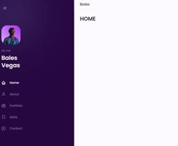|
|288| [Loading Button and Toggle Switch](https://github.com/xml12333/HTML_CSS_JS/tree/main/288.Loading%20Button%20and%20Toggle%20Switch)| [Demo](https://nikt.com.ua/projects/htmlCssJs/288.Loading%20Button%20and%20Toggle%20Switch/)| |
|289| [Show Hide Password](https://github.com/xml12333/HTML_CSS_JS/tree/main/289.Show%20Hide%20Password)| [Demo](https://nikt.com.ua/projects/htmlCssJs/289.Show%20Hide%20Password/)| |
|290| [Social Icon and Button](https://github.com/xml12333/HTML_CSS_JS/tree/main/290.Social%20Icon%20and%20Button)| [Demo](https://nikt.com.ua/projects/htmlCssJs/290.Social%20Icon%20and%20Button/)| |
|291| [Popup](https://github.com/xml12333/HTML_CSS_JS/tree/main/291.Popup)| [Demo](https://nikt.com.ua/projects/htmlCssJs/291.Popup/)| |
|292| [Navbar](https://github.com/xml12333/HTML_CSS_JS/tree/main/292.Navbar)| [Demo](https://nikt.com.ua/projects/htmlCssJs/292.Navbar/)| |
|293| [Accordion](https://github.com/xml12333/HTML_CSS_JS/tree/main/293.Accordion)| [Demo](https://nikt.com.ua/projects/htmlCssJs/293.Accordion/)| 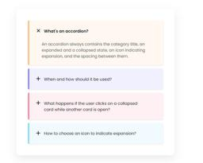|
|294| [Pricing Card](https://github.com/xml12333/HTML_CSS_JS/tree/main/294.Pricing%20Card)| [Demo](https://nikt.com.ua/projects/htmlCssJs/294.Pricing%20Card/)| |
|295| [Neon Card](https://github.com/xml12333/HTML_CSS_JS/tree/main/295.Neon%20Card)| [Demo](https://nikt.com.ua/projects/htmlCssJs/295.Neon%20Card/)| |
|296| [Sidebar](https://github.com/xml12333/HTML_CSS_JS/tree/main/296.Sidebar)| [Demo](https://nikt.com.ua/projects/htmlCssJs/296.Sidebar/)| |
|297| [Glassmorphism Card](https://github.com/xml12333/HTML_CSS_JS/tree/main/297.Glassmorphism%20Card)| [Demo](https://nikt.com.ua/projects/htmlCssJs/297.Glassmorphism%20Card/)| |
|298| [Drag and Drop Card](https://github.com/xml12333/HTML_CSS_JS/tree/main/298.Drag%20and%20Drop%20Card)| [Demo](https://nikt.com.ua/projects/htmlCssJs/298.Drag%20and%20Drop%20Card/)| |
|299| [Login Form](https://github.com/xml12333/HTML_CSS_JS/tree/main/299.Login%20Form)| [Demo](https://nikt.com.ua/projects/htmlCssJs/299.Login%20Form/)| |
|300| [CheckiO](https://github.com/xml12333/HTML_CSS_JS/tree/main/300.CheckiO)| [Demo](https://nikt.com.ua/projects/htmlCssJs/300.CheckiO/)| |
|301| [Manage Responsive Website](https://github.com/xml12333/HTML_CSS_JS/tree/main/301.Manage%20Responsive%20Website)| [Demo](https://nikt.com.ua/projects/htmlCssJs/301.Manage%20Responsive%20Website/)| |
|302| [Resume CV](https://github.com/xml12333/HTML_CSS_JS/tree/main/302.Resume%20CV)| [Demo](https://nikt.com.ua/projects/htmlCssJs/302.Resume%20CV/)| |
|303| [Coffee](https://github.com/xml12333/HTML_CSS_JS/tree/main/303.Coffee)| [Demo](https://nikt.com.ua/projects/htmlCssJs/303.Coffee/)| 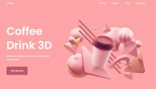|
|304| [Action Button](https://github.com/xml12333/HTML_CSS_JS/tree/main/304.Action%20Button)| [Demo](https://nikt.com.ua/projects/htmlCssJs/304.Action%20Button/)| |
|305| [Sidebar](https://github.com/xml12333/HTML_CSS_JS/tree/main/305.Sidebar)| [Demo](https://nikt.com.ua/projects/htmlCssJs/305.Sidebar/)| 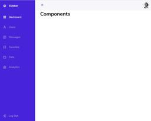|
|306| [MenuBar](https://github.com/xml12333/HTML_CSS_JS/tree/main/306.MenuBar)| [Demo](https://nikt.com.ua/projects/htmlCssJs/306.MenuBar/)| |
|307| [Login Form](https://github.com/xml12333/HTML_CSS_JS/tree/main/307.Login%20Form)| [Demo](https://nikt.com.ua/projects/htmlCssJs/307.Login%20Form/)| |
|308| [Parallax Scrolling](https://github.com/xml12333/HTML_CSS_JS/tree/main/308.Parallax%20Scrolling)| [Demo](https://nikt.com.ua/projects/htmlCssJs/308.Parallax%20Scrolling/)| |
|309| [Sidebar](https://github.com/xml12333/HTML_CSS_JS/tree/main/309.Sidebar)| [Demo](https://nikt.com.ua/projects/htmlCssJs/309.Sidebar/)| |
|310| [Portfolio](https://github.com/xml12333/HTML_CSS_JS/tree/main/310.Portfolio)| [Demo](https://nikt.com.ua/projects/htmlCssJs/310.Portfolio/)| |
|311| [Ecommerce](https://github.com/xml12333/HTML_CSS_JS/tree/main/311.Ecommerce)| [Demo](https://nikt.com.ua/projects/htmlCssJs/311.Ecommerce/)| 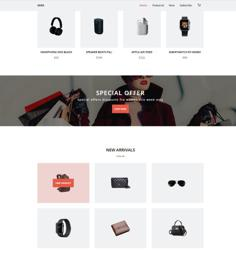|
|312| [Portfolio](https://github.com/xml12333/HTML_CSS_JS/tree/main/312.Portfolio)| [Demo](https://nikt.com.ua/projects/htmlCssJs/312.Portfolio/)| |
|313| [Ecommerce](https://github.com/xml12333/HTML_CSS_JS/tree/main/313.Ecommerce)| [Demo](https://nikt.com.ua/projects/htmlCssJs/313.Ecommerce/)| 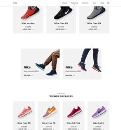|
|314| [Portfolio](https://github.com/xml12333/HTML_CSS_JS/tree/main/314.Portfolio)| [Demo](https://nikt.com.ua/projects/htmlCssJs/314.Portfolio/)| |
|315| [Restaurant](https://github.com/xml12333/HTML_CSS_JS/tree/main/315.Restaurant)| [Demo](https://nikt.com.ua/projects/htmlCssJs/315.Restaurant/)| |
|316| [Landing Christmas](https://github.com/xml12333/HTML_CSS_JS/tree/main/316.Landing%20Christmas)| [Demo](https://nikt.com.ua/projects/htmlCssJs/316.Landing%20Christmas/)| |
|317| [Landing Travel](https://github.com/xml12333/HTML_CSS_JS/tree/main/317.Landing%20Travel)| [Demo](https://nikt.com.ua/projects/htmlCssJs/317.Landing%20Travel/)| |
|318| [Portfolio](https://github.com/xml12333/HTML_CSS_JS/tree/main/318.Portfolio)| [Demo](https://nikt.com.ua/projects/htmlCssJs/318.Portfolio/)| |
